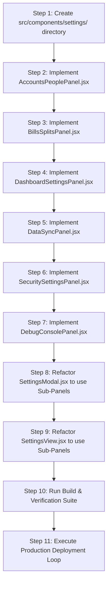

# Implementation Plan - Settings Component Extraction & Refactoring (Audit Item 4.2)

**Document:** `finance/SETTINGS_REFACTOR_PLAN.md`  
**Scope:** Modularize `SettingsModal.jsx` (2,973 lines) and `SettingsView.jsx` (2,802 lines) into shared sub-panels  
**Target Architecture:** React 19 / Pure JS / Tailwind CSS 3.4 / Shared Context Hooks  
**Execution Mode:** Architectural Plan with Strict Halt  

---

## 1. Executive Summary & Problem Analysis

`SettingsModal.jsx` and `SettingsView.jsx` represent ~5,800 lines of nearly identical duplicate JSX markup, local state machines, and event handlers. This duplication has already caused feature drift and runtime errors (e.g., `loadDemoPreset` missing context export, `setupSubTab` reference crashes).

### Goals of Component Extraction:
1. **Single Source of Truth:** Unify the business logic and UI for account management, earner configuration, bill/split scheduling, dashboard preferences, data backup/restore, security profiles, and debug telemetry.
2. **Zero Functional Regression:** Ensure both modal and full-page settings layouts render identically and retain full state synchronization.
3. **Drastic Codebase Slimming:** Reduce `SettingsModal.jsx` and `SettingsView.jsx` from ~5,800 lines down to thin container shells (~100 to 180 lines each), delegating rendering to dedicated modular panels.
4. **Improved Maintainability & Bundle Size:** Isolate heavy third-party dependencies (such as `xlsx` and custom parsers) to their specific sub-panels.

---

## 2. Target Directory & File Architecture

All shared settings panels will be created inside a dedicated sub-directory: `finance/src/components/settings/`.

```
finance/src/components/
├── settings/
│   ├── AccountsPeoplePanel.jsx    # Accounts, Earners & Extra Savings Allocations (~700 lines)
│   ├── BillsSplitsPanel.jsx       # Bills list, inline editing, calendar pickers & split rules (~650 lines)
│   ├── DashboardSettingsPanel.jsx # Widget grid toggle, width slider, theme selector (~200 lines)
│   ├── DataSyncPanel.jsx          # Excel/JSON import/export, cloud vault sync & demo data loader (~500 lines)
│   ├── SecuritySettingsPanel.jsx  # User profile, security question & password change forms (~180 lines)
│   └── DebugConsolePanel.jsx      # Telemetry logger, category/level filter, payload inspector (~300 lines)
├── SettingsModal.jsx              # Thin modal container with backdrop, header, sidebar & active panel (~160 lines)
└── SettingsView.jsx               # Thin full-page container with header, top bar nav & active panel (~140 lines)
```

---

## 3. Detailed Component Breakdown & API Contracts

### 3.1 `AccountsPeoplePanel.jsx`
- **Responsibilities:**
  - Account creation form (name, type, color, starting balance, extra starting balance, enable extra savings toggle, monthly savings target).
  - Account cards list: inline editing, delete account confirmation dialog with cascading bill-orphan warnings, clear account transactions trigger.
  - Earner / Person creation form: name, role, pay frequency (weekly, bi-weekly, semi-monthly, monthly), pay days, gross/net compensation.
  - Earners list: inline editing, earner deletion.
  - Extra savings earner distribution table: per-person percentage and dollar allocation matrix.
- **Context Dependencies:**
  - `useBudgetMetadata()`: `budget`, `addAccount`, `updateAccount`, `deleteAccount`, `addPerson`, `updatePerson`, `deletePerson`.
  - `useLedgerDataDispatch()`: `clearAccountTransactions`.
- **Props Interface:**
  - None required (fully self-contained via Context).

---

### 3.2 `BillsSplitsPanel.jsx`
- **Responsibilities:**
  - Account filter dropdown & search input.
  - Active vs. Archived bills view toggles.
  - New bill creation form: name, amount, due day, payment account, frequency, custom matching key, earner split allocation sliders.
  - Bills list table: inline edit bill name, inline edit amount, due day popover (`NoYearCalendarPicker`), custom matching keys, archive/unarchive actions, delete bill confirmation.
  - Split rules manager: percentage split adjustments with live household earner distribution previews.
- **Context Dependencies:**
  - `useBudgetMetadata()`: `budget`, `addBill`, `updateBill`, `deleteBill`, `archiveBill`, `unarchiveBill`, `updateBillSplits`, `getBillMonthlyCost`, `getBillPersonMonthlyPortion`.
- **Props Interface:**
  - `initialTab?: 'bills' | 'splits'` (optional default sub-tab focus).

---

### 3.3 `DashboardSettingsPanel.jsx`
- **Responsibilities:**
  - Color theme preference selector (Dark vs. Light mode).
  - Dashboard header visibility toggle.
  - Widget grid manager: Toggle widget visibility, toggle widget width (half vs. full width), reorder widgets via up/down buttons, reset widgets to factory defaults.
- **Context Dependencies:**
  - `useBudgetMetadata()`: `theme`, `setTheme`, `dashboardWidgets`, `toggleDashboardWidgetVisibility`, `setDashboardWidgetWidth`, `reorderDashboardWidgets`, `resetDashboardWidgets`, `budget`, `setHideDashboardHeader`.
- **Props Interface:**
  - None required.

---

### 3.4 `DataSyncPanel.jsx`
- **Responsibilities:**
  - Excel workbook export generator (`XLSX` multi-sheet workbook generation).
  - JSON backup download & JSON restore file reader (`restoreFromBackup`).
  - Spreadsheet Importer wrapper (`SpreadsheetImporter.jsx`).
  - Cloud Sync Vault: Passcode validation with `/api/verify-sync-code`, push backup to Cloudflare D1 (`pushCloudBackup`), pull backup from Cloudflare D1 (`pullCloudRestore`), auto-cloud backup toggle, last sync timestamp indicator.
  - Database Management: Clear all data confirmation, reset to defaults confirmation, 100% fake demo dataset loader (`loadDemoPreset`).
- **Context Dependencies:**
  - `useBudgetMetadata()`: `budget`, `isAutoCloudBackupEnabled`, `toggleAutoCloudBackup`, `lastCloudSyncTime`.
  - `useLedgerDataState()`: `syncPasscode`, `isSyncUnlocked`.
  - `useLedgerDataDispatch()`: `resetToDefaults`, `clearAllData`, `exportBackupJson`, `restoreFromBackup`, `pushCloudBackup`, `pullCloudRestore`, `loadDemoPreset`, `setSyncPasscode`, `setIsSyncUnlocked`.
  - `useAuth()`: `isAuthenticated`.
- **Props Interface:**
  - `initialSubSection?: 'import' | 'sync' | 'backup'` (optional default view filter).

---

### 3.5 `SecuritySettingsPanel.jsx`
- **Responsibilities:**
  - Profile update form: Name, Email address.
  - Security Question & Answer configuration form (`PRESET_SECURITY_QUESTIONS`).
  - Password Change form: Current password verification, new password confirmation.
- **Context Dependencies:**
  - `useAuth()`: `user`, `updateProfile`.
- **Props Interface:**
  - None required.

---

### 3.6 `DebugConsolePanel.jsx`
- **Responsibilities:**
  - Debug mode global toggle (`isDebugMode`, `setDebugMode`).
  - Telemetry log stream viewer: Filter by severity level (all, info, warn, error), filter by category, full-text search query.
  - Expanded log row inspector (`DebugPayloadInspector.jsx`).
  - Diagnostics actions: Copy single log JSON, copy all logs, export logs to JSON file, generate test diagnostic telemetry events, clear logs.
- **Context Dependencies:**
  - `useBudgetMetadata()`: `isDebugMode`, `setDebugMode`, `debugLogs`, `clearDebugLogs`, `addDebugLog`.
- **Props Interface:**
  - None required.

---

## 4. Container Component Redesign

### 4.1 `SettingsModal.jsx` (Modal Wrapper)
- **Structure:**
  - Guard: `if (!isSettingsOpen) return null;`
  - Fixed full-screen backdrop with blur and modal exit click handler (`setIsSettingsOpen(false)`).
  - Modal Header: Title, active tab badge, close button (`X`).
  - Navigation: Vertical sidebar navigation for desktop, horizontal scrollable tab bar for mobile.
  - Dynamic Body: Switch statement rendering the corresponding extracted panel based on `settingsTab`:
    - `'accounts'` / `'people'` -> `<AccountsPeoplePanel />`
    - `'bills'` / `'splits'` -> `<BillsSplitsPanel />`
    - `'dashboard'` -> `<DashboardSettingsPanel />`
    - `'data'` / `'sync'` / `'import'` -> `<DataSyncPanel />`
    - `'security'` -> `<SecuritySettingsPanel />`
    - `'debug'` -> `<DebugConsolePanel />`

### 4.2 `SettingsView.jsx` (Full-Page View)
- **Structure:**
  - Top Compact Header: Icon, title, description, and "Back to Dashboard" navigation button.
  - Horizontal Navigation Bar: Sections list (`Setup`, `Dashboard`, `Import`, `Sync`, `Security`, `Debugging`) with auto-save indicators.
  - Setup Sub-Navigation Bar: Sub-tabs (`Accounts & Earners`, `Bills & Splits`).
  - Dynamic Content Container: Switch statement rendering the corresponding extracted panel based on `settingsTab`.

---

## 5. Step-by-Step Execution Sequence

To ensure zero downtime and keep `npm run build` passing at every step:



1. **Step 1:** Create directory `finance/src/components/settings/`.
2. **Step 2:** Extract `AccountsPeoplePanel.jsx` (accounts, earners, and extra savings split tables).
3. **Step 3:** Extract `BillsSplitsPanel.jsx` (bills list, inline edit, `NoYearCalendarPicker`, split percentage sliders).
4. **Step 4:** Extract `DashboardSettingsPanel.jsx` (theme, header visibility, widget manager).
5. **Step 5:** Extract `DataSyncPanel.jsx` (Excel/JSON export, restore, `SpreadsheetImporter`, Cloud Sync Vault, `loadDemoPreset`).
6. **Step 6:** Extract `SecuritySettingsPanel.jsx` (profile, security questions, password change).
7. **Step 7:** Extract `DebugConsolePanel.jsx` (telemetry filter, `DebugPayloadInspector`, log export).
8. **Step 8:** Refactor `SettingsModal.jsx` to import and render the modular panels.
9. **Step 9:** Refactor `SettingsView.jsx` to import and render the modular panels.
10. **Step 10:** Verify with `npm run build` in `finance/`.
11. **Step 11:** Execute `npm run deploy` (`wrangler deploy`) and verify Cloudflare Worker deployment.

---

## 6. Verification & Safety Plan

### Automated Checks:
- Execute `npm run build` in `finance/` to confirm zero bundle, import, or JSX syntax errors.
- Confirm total bundle size reduction and chunking improvements.

### Manual Verification Flow:
1. **Accounts & Earners:** Add/edit an account, change colors, toggle extra savings, add earner, test deletion confirmation.
2. **Bills & Splits:** Add bill, edit due date with calendar popover, adjust earner split percentages, verify monthly cost calculation.
3. **Dashboard Preferences:** Toggle dark/light theme, toggle widget visibility and width.
4. **Data Management:** Test JSON export, test Demo Preset loading, test Cloud Sync Vault lock/unlock.
5. **Security:** Verify profile inputs, check security question dropdown.
6. **Debugging:** Toggle debug mode, trigger test logs, inspect JSON payload tree.

---

## 7. Mandatory Execution Halt Notice

In strict accordance with the task directives and antipilot override commands:
- **No React components, files, or application code have been modified, created, or deleted during this planning run.**
- The implementation strategy is completely documented in this artifact.
- Execution is now **HALTED**.

To proceed with executing the modular extraction outlined above, reply with the exact phrase:
> **"Plan approved, proceed with implementation."**
